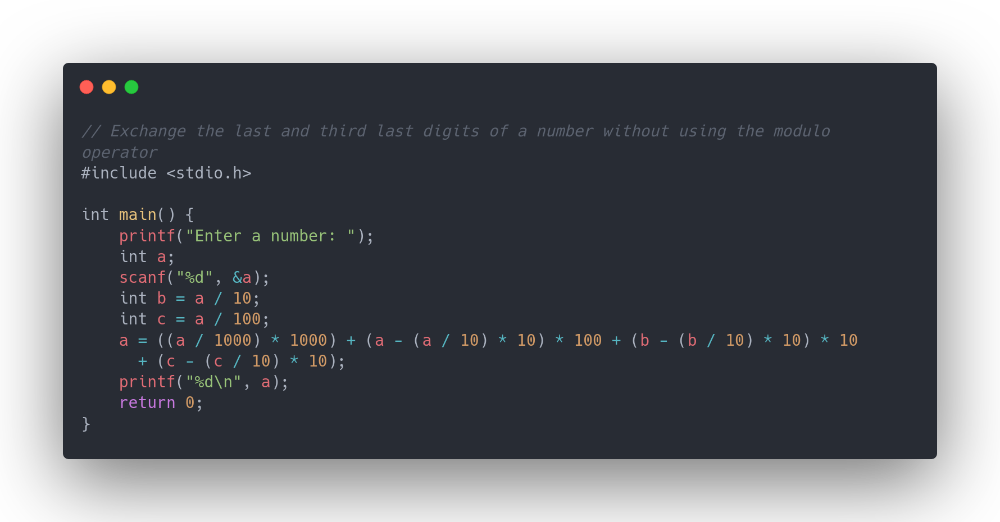

# ESC103

## Homeworks

### Assignment 1

* [Find the quotient and remainder](assignment-1/problem-01.c)
* [Find the last digit of a number](assignment-1/problem-02.c)
* [Join a digit to the end of a number](assignment-1/problem-03.c)
* [Remove the last digit of a number](assignment-1/problem-04.c)
* [Remove the last two digit of a number](assignment-1/problem-05.c)
* [Print the second last digit of a number](assignment-1/problem-06.c)
* [Find the summation of the last two digits of a number](assignment-1/problem-07.c)
* [Double the last digit of a number](assignment-1/problem-08.c)
* [Double the second last digit of a number](assignment-1/problem-09.c)
* [Remove the second last digit of a number](assignment-1/problem-10.c)
* [Exchange the last two digits of a number](assignment-1/problem-11.c)
* [Exchange the last and the third last digits of a number](assignment-1/problem-12.c)
* [Find the product after removing the last and second last digits](assignment-1/problem-13.c)
* [Find the product after exchanging the last digits](assignment-1/problem-14.c)
* [Find the last digit of a number without using the modulo operator](assignment-1/problem-15-a.c)
* [Find the second last digit of a number without using the modulo operator](assignment-1/problem-15-b.c)
* [Remove the second last digit without using the modulo operator](assignment-1/problem-15-c.c)
* [Exchange the last two digits without using the modulo operator](assignment-1/problem-15-d.c)
* [Exchange the last and third last digits of a number without using the modulo operator](assignment-1/problem-15-e.c)
* [Find the K-th digit from the back of a number](assignment-1/problem-15-f.c)

### Assignment 2

* [Find the first fractional digit](assignment-2/problem-01.c)
* [Insert '1' as the first fractional digit](assignment-2/problem-02.c)
* [Find the second fractional digit](assignment-2/problem-03.c)
* [Delete the digit at the units place](assignment-2/problem-04.c)
* [Delete the first fractional digit](assignment-2/problem-05.c)
* [Delete the second fractional digit](assignment-2/problem-06.c)
* [Insert '1' at the units place](assignment-2/problem-07.c)
* [Double the first fractional digit](assignment-2/problem-08.c)
* [Exchange the digits in units and tens place](assignment-2/problem-09.c)
* [Sum of the units place digit and the first fractional digit](assignment-2/problem-10.c)
* [Exchange the units place digit and the first fractional digit](assignment-2/problem-11.c)
* [Sum of the first two fractional digits](assignment-2/problem-12.c)
* [Find the sum of k number of fractional digits](assignment-2/problem-13.c)
* [Find the sum of k number of whole number digits](assignment-2/problem-14.c)
* [Delete the kth fractional digit](assignment-2/problem-15.c)

## Screenshots

## Disclaimer

I take zero liability for the damage caused to you by this low-effort code. Please use the code above at your discretion.
